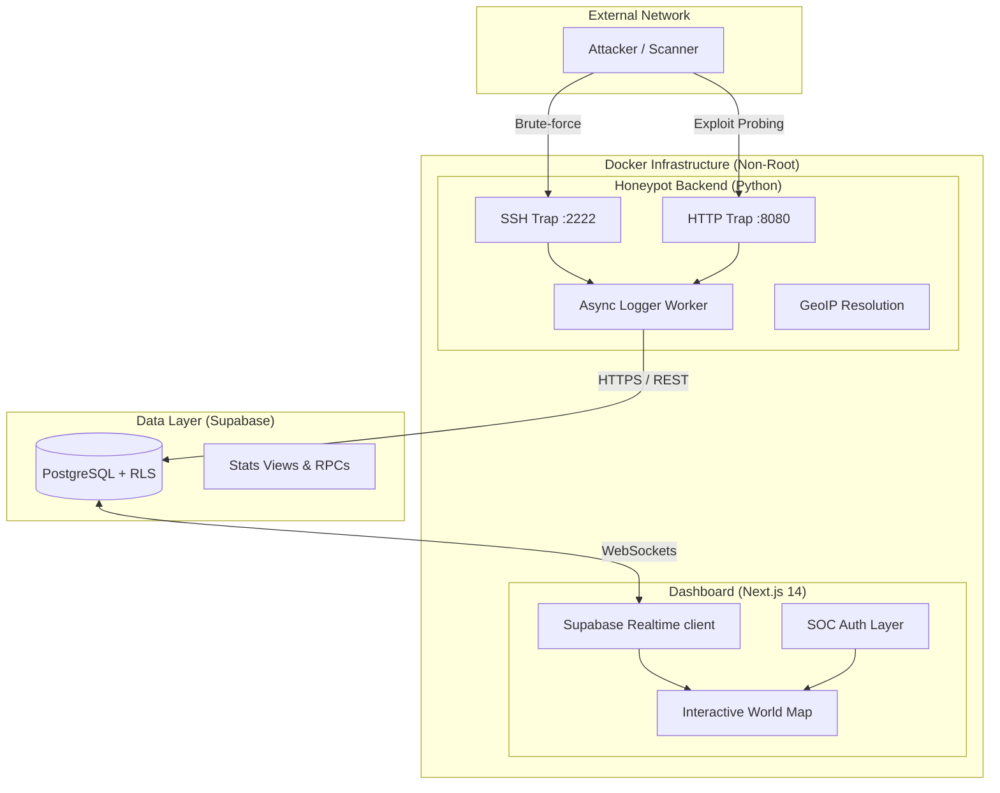

# 🛡️ HoneyTrap — Advanced Threat Intelligence SOC

HoneyTrap is a professional-grade SSH and HTTP honeypot designed for real-time threat analysis and visualization. Built with a security-first mindset, it captures attacker behavior and visualizes global attack patterns in a modern, interactive SOC (Security Operations Center) dashboard.

## ✨ Key Features

### 🕸️ Multi-Layered Honeypot
- **SSH Trap (Port 2222):** Simulates an OpenSSH 8.9p1 server. Captures all authentication attempts, provides artificial response delays to slow down brute-force attacks, and calculates threat scores based on common credentials and repeat offenders.
- **HTTP Trap (Port 8080):** A polymorphic web trap simulating Apache/2.4.41. It includes multiple fake attack surfaces:
    - WordPress login portal (`/wp-login.php`)
    - Exposed environment files (`/.env`)
    - Sensitive system files (`/etc/passwd`)
    - Web shell interfaces (`/shell`, `/cmd`)
    - PHP configuration leaks (`/phpinfo`)

### 📊 Real-Time SOC Dashboard
- **Interactive Heatmap:** Live global visualization of attack origins using `react-simple-maps`.
- **Supabase Realtime:** Immediate event updates via WebSockets for the live threat feed.
- **Advanced Analytics:** Dynamic timeline of attacks, top credential analysis, and service targeting distribution.
- **Secure Access:** Restricted dashboard access with a mock SOC Clearance layer.

### 🛡️ Engineering Excellence
- **Non-Root Architecture:** All services run as unprivileged users (UID 1001) for container escape mitigation.
- **Asynchronous Logging:** Non-blocking event logging using Python's `queue.Queue` and thread-safe workers.
- **Data Integrity:** Supabase PostgreSQL with Row Level Security (RLS) policies.
- **Automated CI/CD:** Integrated security scanning (Bandit, Gitleaks) and build verification.

## 🏗️ Architecture



## 🚀 Quick Start

### 1. Requirements
- Docker & Docker Compose
- A Supabase Project (Free Tier)

### 2. Database Setup
Execute the SQL in `supabase/schema.sql` within your Supabase SQL Editor. This will create the tables, indexes, RLS policies, and the advanced stats RPC.

### 3. Configuration
```bash
cp .env.example .env
# Edit .env with your SUPABASE_URL and SUPABASE_SERVICE_KEY
```

### 4. Launch
```bash
docker-compose up -d
```

## ⚠️ Legal Disclaimer
HoneyTrap is for educational and research purposes only. It is designed to be deployed on infrastructure you own. The authors are not responsible for any misuse. **Never use this to gain unauthorized access to any system.**

---
*Created by Alexis Delburg — Cybersecurity Student @ PSTB | Portfolio Project*
